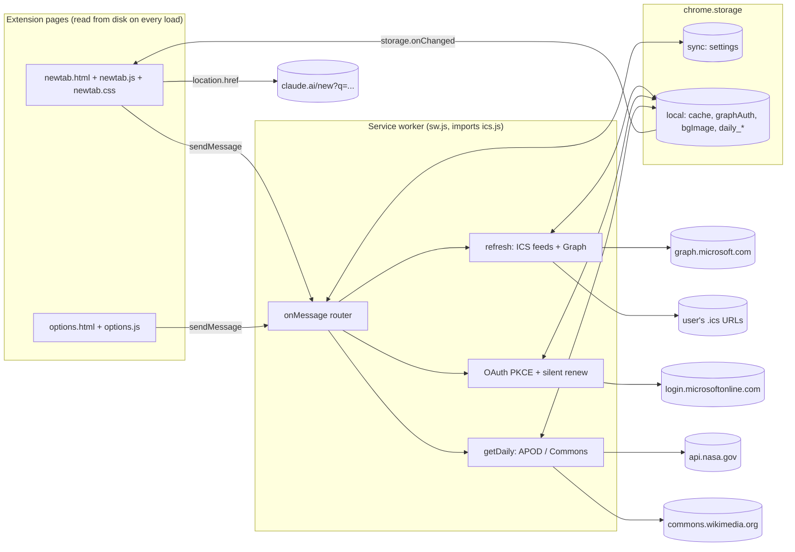

# How Claude New Tab works

A developer's guide to the codebase. Read this before changing anything; it explains what the
product does, how the pieces fit, where state lives, and the handful of non-obvious traps
(especially around the service worker and Microsoft sign-in).

---

## 1. What the product is

Claude New Tab is a Manifest V3 browser extension for Microsoft Edge (and any Chromium browser)
that replaces the new tab page with a personal start page:

| Area | What the user sees |
| --- | --- |
| **Claude prompt box** | Type a prompt, press Enter, and claude.ai opens with the prompt prefilled. Quick-prompt chips insert prefixes or send ready-made prompts. "Plan my day" sends today's remaining calendar to Claude. |
| **Agenda** | Today plus the next few days of events from Microsoft 365 (live, via Microsoft Graph) and/or any iCal `.ics` feeds. Ended events disappear, the current one is highlighted, Teams meetings get a Join link. |
| **Quick links** | A grid of user-defined links with favicons. |
| **Backgrounds** | Default system theme, a solid color, gradient presets, an uploaded or linked image, NASA's Astronomy Picture of the Day, Wikimedia Commons' Picture of the Day, or alternating between the two daily. Daily pictures get an ⓘ icon with the explanation/caption and a link to the source. |
| **Settings page** | Everything above is configurable; Microsoft sign-in lives here too. |

There is no server. Everything runs in the browser; the only network calls are to Microsoft
(login + Graph), the calendar feeds and picture APIs the user picks, claude.ai when opened, and
Google's favicon service for quick-link icons.

---

## 2. Architecture in one picture



Three rules that follow from this shape:

1. **Pages never fetch calendar data themselves.** They ask the worker (`chrome.runtime.sendMessage`)
   and render whatever comes back. The worker owns all network I/O, tokens, and caching.
2. **The worker is stateless between wakeups.** MV3 workers are killed when idle, so every piece of
   state it needs is in `chrome.storage`. Module-level variables (like the in-flight `refreshing`
   promise) are only de-duplication within a single wakeup.
3. **Pages are hot; the worker is not.** Edge reads `newtab.*` and `options.*` from disk on every
   load, so UI edits are live immediately. The worker script is cached by the browser; see §10.

---

## 3. File-by-file

| File | Role |
| --- | --- |
| `manifest.json` | MV3 manifest. `chrome_url_overrides.newtab` makes `newtab.html` the new tab. Declares the worker (`sw.js`), permissions, host permissions, optional host permissions, and a fixed `key` (see §9). |
| `sw.js` | The service worker. Message router, settings access, the refresh pipeline, Microsoft OAuth, Graph queries, and the picture-of-the-day fetchers. ~370 lines. |
| `ics.js` | Dependency-free iCalendar parser with recurrence expansion. Loaded into the worker via `importScripts`. ~330 lines. |
| `newtab.html/css/js` | The new tab page: clock, prompt box, chips, agenda, links, background, ⓘ card. |
| `options.html/js` | Settings page. Also drives Microsoft sign-in and iCal host-permission prompts (both need a user gesture). |
| `icon.png` | Extension icon (128px, used at all sizes). |
| `build.sh` | Produces `dist/claude-newtab-<version>.zip` for the store, with the `key` stripped. |
| `store/` | Store logo (300px) and listing text with permission justifications. |
| `PRIVACY.md` | Privacy policy (the store requires a public URL; this file on GitHub is it). |
| `README.md` | Install/usage/publishing quick reference. |
| `.extension-key.pem` | **Not committed.** Private half of the manifest `key`. Not needed at runtime. |

---

## 4. Where state lives

### 4.1 `chrome.storage.sync` → `settings`

One object under the key `settings`. Written only by `saveSettings` (from the options page, or the
new tab's sign-in button). Read via the worker's `getSettings()`, which merges over
`DEFAULT_SETTINGS` and **drops empty-string values inside `graph`** so a blank field can't
override a default.

```js
{
  name: 'Bryan',                    // greeting
  claudeBase: 'https://claude.ai',  // base for all Claude links
  daysAhead: 3,                     // agenda horizon (1–14)
  showPast: false,                  // keep ended events visible (dimmed)
  prompts: [{ label, text }],       // chips; text '__PLAN_DAY__' is the built-in planner
  links:   [{ label, url }],        // quick links
  feeds:   [{ name, url, color }],  // iCal feeds
  graph: { clientId, tenant, includeAllCalendars },   // Entra app registration
  bg: {                             // background
    type: 'default'|'color'|'gradient'|'image'|'apod'|'commons'|'rotate',
    color, gradient, imageUrl, dim, frost, tone: 'auto'|'light'|'dark',
    nasaKey, apodHd,
  },
}
```

`sync` has an 8 KB per-item limit, which is why images are **not** stored here.

### 4.2 `chrome.storage.local`

| Key | Written by | Contents |
| --- | --- | --- |
| `cache` | `doRefresh` | `{ events: Event[], errors: string[], fetchedAt, winStart, winEnd }` — the merged, sorted agenda. |
| `graphAuth` | `authorize`, `graphToken` | `{ accessToken, refreshToken, expiresAt, rtIssuedAt, name, email }`. |
| `bgImage` | options page | A data-URL JPEG of the uploaded background (resized ≤2560×1600). |
| `daily_apod`, `daily_commons` | `getDaily` | Today's picture record (§7.3). |

### 4.3 The `Event` shape (what the agenda renders)

Both sources are normalized to this before caching, so `newtab.js` never knows where an event came from:

```js
{
  id, uid, title,
  start, end,          // epoch ms; all-day events are local midnight → next local midnight
  allDay, location, description, url,
  joinUrl,             // Graph only: Teams/online meeting link
  busy,                // TRANSP / showAs
  source,              // calendar or feed name (shown under the title)
  color,               // dot color: feed color or Graph calendar hexColor
  organizer,           // Graph only
}
```

---

## 5. The message protocol

Pages call `send(type, extra)` (a tiny wrapper around `chrome.runtime.sendMessage`). The worker's
`onMessage` handler is async, replies via `sendResponse`, and returns `true` to keep the channel open.
Every reply is `{ ok: true, ... }` or `{ ok: false, error }`.

| Message | Reply | Notes |
| --- | --- | --- |
| `getSettings` | `{ settings }` | Merged with defaults. |
| `saveSettings { settings }` | `{}` | Writes sync storage, then kicks off a refresh. |
| `getEvents` | `{ cache }` | Returns the cache immediately; if it's older than 10 min, starts a background refresh whose result arrives via `storage.onChanged`. |
| `refresh` | `{ cache }` | Forces a refresh and waits for it. |
| `graphSignIn` | `{ auth }` | Interactive OAuth; opens the Microsoft popup. |
| `graphSignOut` | `{}` | Deletes `graphAuth`, refreshes. |
| `graphStatus` | `{ auth \| null }` | Summary (name, email, expiry) without tokens. |
| `testFeed { url }` | `{ count, name }` | Fetches a feed and counts VEVENTs (settings page "test"). |
| `getDaily { source, force }` | `{ daily }` | `source` is `'apod'` or `'commons'`; pages resolve `'rotate'` before asking. |

The new tab paints instantly because `getEvents` never waits on the network: it returns the last
cache, and the page re-renders when `storage.onChanged` fires for `cache`.

---

## 6. The calendar pipeline

### 6.1 Refresh cycle

* `chrome.alarms` fires `refresh` every 10 minutes (`REFRESH_MINUTES`). `onInstalled` and
  `onStartup` also trigger one.
* `refresh()` de-duplicates concurrent calls with a module-level promise.
* `doRefresh()` computes a window: local midnight today → `daysAhead + 1` days later. It then runs,
  **in parallel**: one fetch+parse per iCal feed, one Graph job if a `clientId` is configured, and a
  prefetch of today's picture if the background is a daily mode. Failures are collected into
  `errors[]` (shown in red under the agenda) rather than aborting the refresh.
* Events are sorted all-day first, then by start, and written to `cache`.

### 6.2 iCal feeds (`ics.js`)

`ICS.parseICS(text, winStart, winEnd)` returns event *instances* overlapping the window. Pipeline:

1. **`tokenize`** unfolds continuation lines (leading space/tab), then splits each line into
   `{ name, params, value }`, honoring quoted parameter values that contain `:`.
2. **VEVENT collection** — only properties inside `BEGIN:VEVENT … END:VEVENT` are kept.
3. **Date parsing (`parseDateValue`)** handles the three iCal flavors:
   * `VALUE=DATE` → all-day, local midnight.
   * `…Z` → UTC.
   * `TZID=…` → wall-clock time in that zone. Outlook emits **Windows zone names**
     ("Central Standard Time"); `WINDOWS_TZ` maps ~50 of them to IANA. Conversion to an instant uses
     the `Intl.DateTimeFormat` round-trip trick in `zonedToUtc` (two iterations handle DST edges).
   * No zone → "floating", interpreted as local time.
4. **Duration** from `DTEND`, else `DURATION` (`PnDTnHnMnS`), else 1 day for all-day / 0 otherwise.
5. **Recurrence (`expandRRule`)** supports `FREQ=DAILY|WEEKLY|MONTHLY|YEARLY`, `INTERVAL`, `COUNT`,
   `UNTIL`, `BYDAY` (with ordinals like `2FR` / `-1MO`), `BYMONTHDAY`, `BYMONTH`, `WKST`.
   Occurrences are generated in the event's own wall-clock frame from `DTSTART` forward (so `COUNT`
   is honored), capped at 20 000 iterations, and filtered to the window.
6. **Exceptions**: `EXDATE` instants are skipped; a VEVENT with `RECURRENCE-ID` replaces the master's
   instance at that instant (collected in `overridesByUid` before expansion). `STATUS:CANCELLED` is dropped.

Not supported (rare in practice): `BYSETPOS`, `BYHOUR`, `BYWEEKNO`, `RDATE`, sub-day frequencies.

### 6.3 Microsoft 365 via Graph

Uses **OAuth 2.0 authorization-code + PKCE** through `chrome.identity.launchWebAuthFlow`.
No client secret exists; the Entra app is registered as a **Single-page application** with redirect
URI `https://<extension-id>.chromiumapp.org/` (`chrome.identity.getRedirectURL()`).

```
authorize({ interactive, prompt, loginHint })
  ├─ build /authorize URL with code_challenge (S256), state, scope
  ├─ launchWebAuthFlow → redirect URL with ?code=
  ├─ tokenRequest(grant_type=authorization_code, code_verifier)
  └─ store graphAuth { accessToken, refreshToken, expiresAt, rtIssuedAt, name, email }
```

`graphSignIn` = `authorize` with `interactive: true, prompt: 'select_account'`.
`silentSignIn` = `authorize` with `interactive: false, prompt: 'none', login_hint: <email>` — it
reuses the browser's existing Microsoft session cookie, no UI.

**The 24-hour trap.** Microsoft gives SPA clients refresh tokens with a *fixed* 24 h lifetime
(error `AADSTS700084` when they expire; they cannot be extended by refreshing). `graphToken()` therefore:

1. If the refresh token is older than `RT_RENEW_AFTER` (20 h), tries a silent re-authorization first.
2. Else returns the access token if still valid.
3. Else refreshes with `grant_type=refresh_token`.
4. If that fails, tries silent re-authorization; if that also fails, throws
   `Session expired, sign in again (…)` — the agenda shows the sign-in button when it sees this text.

Why not a "Mobile and desktop" (public client) registration, whose refresh tokens last 90 days?
Because the token endpoint rejects requests that carry an `Origin` header (which a worker `fetch`
always sends) unless the redirect URI is SPA-type (`AADSTS9002326`).

**Queries.** `fetchGraphEvents` lists `/me/calendars` (if `includeAllCalendars`) and calls
`/calendarView?startDateTime&endDateTime` on each, in parallel, following `@odata.nextLink` up to 5
pages. Graph expands recurrences server-side, so no RRULE work is needed. Times come back in UTC and
are parsed with a `Z` suffix; all-day events are turned into local-midnight ranges.

---

## 7. Backgrounds and pictures of the day

### 7.1 Applying a background (`applyBackground` in newtab.js)

The page resets `body` classes/inline styles, then per `bg.type`:

* `color` → `background-color`; tone auto-picked by relative luminance (`luminance()` > 0.4 = light).
* `gradient` → one of `GRADIENTS` (duplicated in options.js for the preview); `peach` and `mist` are light.
* `image` → `bg.imageUrl`, else the `bgImage` data URL from local storage.
* `apod` / `commons` / `rotate` → ask the worker for `getDaily`; `rotate` resolves to APOD on even
  days and Commons on odd days (`rotateSource()`, based on the local calendar day).

For any custom background the body gets `bg-custom` (cover/fixed image, plus a `::before` overlay
whose opacity is `--dim`) and, if `frost` is on, `bg-frost` (cards become translucent with
`backdrop-filter: blur`). The palette is chosen by `data-tone` on `<body>`, which overrides the
`prefers-color-scheme` default. Tone is `bg.tone` unless `'auto'`.

### 7.2 Uploaded images

The options page decodes the file with `createImageBitmap`, draws it to a canvas scaled to fit
2560×1600, and stores a JPEG data URL (quality 0.86, falling back to 0.7 if over ~6 MB) in
`chrome.storage.local.bgImage`. Local storage does not sync, so the picture stays on that device.

### 7.3 Daily pictures (`getDaily` in sw.js)

Cache key `daily_<source>`; a record is reused while `fetchedFor` equals today's local date and it's
less than `DAILY_TTL` (6 h) old. On failure, a stale record is returned with an `error` field rather
than nothing. Record shape:

```js
{ source, date, imageUrl, title, text, credit, sourceUrl, sourceName, fetchedFor, fetchedAt }
```

* **NASA APOD** — `GET https://api.nasa.gov/planetary/apod?api_key=…&date=YYYY-MM-DD`. Walks back up
  to 7 days when the day's entry is missing or `media_type !== 'image'`. Uses `hdurl` unless
  `apodHd` is false. `DEMO_KEY` is the default and is rate-limited per IP; users can paste their own
  key. `sourceUrl` is the human page `apod.nasa.gov/apod/apYYMMDD.html`.
* **Wikimedia Commons** — three MediaWiki API calls: `Template:Potd/<UTC date>` → file title;
  `imageinfo` with `iiurlwidth=2560` → `thumburl`, `descriptionurl`, `extmetadata` (artist,
  license, description); `Template:Potd/<date> (en)` wikitext → the caption (`stripWiki` removes
  `[[links]]`, `{{templates}}`, quotes). Walks back up to 4 days.

The new tab's `showDailyInfo` fills the ⓘ card with `textContent` only (never `innerHTML`), because
this text comes from third parties.

---

## 8. Agenda rendering rules (`renderAgenda`)

* Days are iterated from today for `daysAhead` days. Today is always shown; later days only if they
  have events.
* An event belongs to a day if it overlaps `[dayStart, dayEnd)`; multi-day events show `…` / `→`
  markers on the time.
* **Ended timed events are hidden** unless `showPast` is set; all-day events stay. If today had
  events but none remain, the copy is "No more events today." instead of "Nothing scheduled".
* The event in progress gets `.now` (accent bar + soft background); with `showPast`, ended ones get `.past` (dimmed).
* `tickClock` runs every second and re-renders the agenda so highlights stay correct without a refresh.
* Everything user- or server-supplied goes through `escapeHtml` before being placed in the DOM.

"Plan my day" (`planDayPrompt`) builds a prompt from today's *remaining* events and opens
`${claudeBase}/new?q=<encoded prompt>`. Ctrl/Cmd+Enter (or Ctrl-click on a chip) opens in a new tab.

---

## 9. Permissions and security model

`manifest.json`:

* `permissions`: `storage`, `alarms`, `identity`.
* `host_permissions`: Microsoft login + Graph, `api.nasa.gov`, `apod.nasa.gov`,
  `commons.wikimedia.org`, `upload.wikimedia.org` — the hosts the worker fetches from.
* `optional_host_permissions`: `https://*/*`, `http://*/*` — **requested per-origin** when the user
  saves an iCal feed (`requestFeedPermissions` in options.js). `chrome.permissions.request` must run
  inside a user gesture, which is why it's in the Save click handler and not in the worker.

Other points:

* No secrets in the repo. The Entra client ID is not a secret (SPAs ship it in public JS), but it
  was removed from the defaults anyway so the repo is generic; users enter their own in Settings.
* The manifest `key` is a **public** key. Its purpose is to pin the extension ID for unpacked
  installs so the OAuth redirect URI is stable across machines. Stores reject a `key` field, so
  `build.sh` strips it (the store assigns its own ID, which needs its own redirect URI in Entra).
* Tokens live only in `chrome.storage.local` on the device. Sign out removes them.
* The default page CSP for MV3 (`script-src 'self'`) applies: no inline scripts, no remote code.
  Remote *images* are allowed, which is what backgrounds and favicons rely on.

---

## 10. Development workflow and the traps

### Loading it

Edge → `edge://extensions` → Developer mode → **Load unpacked** → the repo folder. On Linux you can
instead add the folder to `--load-extension=` in `~/.config/microsoft-edge-stable-flags.conf` (the
Omarchy pattern); the same works for Chromium's flags file.

### Trap 1: the worker script is cached

Edge keeps the **first-registered** worker script for an extension loaded with `--load-extension`,
even across version bumps and browser restarts. Symptoms: the pages show new UI but new worker
messages return `unknown message`, or old defaults keep applying. Fixes, in order of convenience:

1. Click **Reload** on `edge://extensions` (re-registers the worker).
2. Rename the worker file and update `background.service_worker` in the manifest — a new script URL
   forces a fresh registration. This is why the file is `sw.js` and not `background.js`.

Pages (`newtab.*`, `options.*`) are unaffected: they're read from disk every time.

### Trap 2: `importScripts` after install

A service worker may only import scripts it imported during its first evaluation. Don't try to
"cache-bust" `ics.js` with a query string; rename or reload as above.

### Trap 3: Chromium refuses remote debugging on the default profile

You cannot attach CDP to the user's real profile. Use a scratch profile (below).

### Headless testing recipe

```bash
msedge --headless=new --no-first-run --disable-gpu \
  --user-data-dir=/tmp/edgeprof --load-extension="$PWD" \
  --remote-debugging-port=9333 about:blank &
# then drive it over CDP (node ≥22 has a global WebSocket):
#   Target.createTarget { url: 'chrome-extension://<id>/newtab.html' }
#   Target.attachToTarget { flatten: true } → Runtime.evaluate / Page.captureScreenshot
```

Inside `Runtime.evaluate` you can call `chrome.runtime.sendMessage({type:'saveSettings', …})` to set
up state, `{type:'refresh'}` to pull data, then read `document.getElementById('agenda').innerText`.
For iCal tests, serve a fixture with a tiny CORS-enabled HTTP server (the worker won't have host
permission for `127.0.0.1` in a scratch profile, but CORS `*` is enough).

The extension ID for unpacked installs from this repo is `gfdflaodlclbohbbambnoacdnieifmao`
(derived from the manifest `key`).

### Releasing

1. Bump `version` in `manifest.json` (and rename `sw.js` if the worker changed and you rely on
   `--load-extension`).
2. `./build.sh` → `dist/claude-newtab-<version>.zip`.
3. Partner Center → Microsoft Edge Add-ons → upload. The listing text and permission justifications
   are in `store/listing.md`; the privacy policy URL is `PRIVACY.md` on GitHub.
4. After the first publish, add `https://<store-assigned-id>.chromiumapp.org/` as an SPA redirect URI
   on the Entra app.

Note: the Edge program only accepts a *personal* Microsoft account (or GitHub sign-in) for the
publisher, not a work/school account.

### Setting up Microsoft sign-in for a new tenant

Entra admin center → App registrations → New: single tenant, platform **SPA**, redirect URI from
the settings page, delegated `Calendars.Read` + `User.Read`, grant admin consent. Paste the
Application (client) ID and Directory (tenant) ID into Settings. A single-tenant app must use its
tenant ID (not `organizations`) as the authority, which is why the tenant field exists.

---

## 11. Extending it

Some natural next steps and where they'd go:

* **Another calendar source** (Google Calendar API, CalDAV): add a fetcher in `sw.js` that returns
  `Event[]`, push it into `jobs` in `doRefresh`, add its host to `host_permissions`. Nothing in the
  pages changes.
* **Another daily-picture source**: implement `fetchX()` returning the §7.3 record shape, route it
  in `getDaily`, add the radio in `options.html`, extend `DAILY_TYPES`.
* **Recent Claude chats**: would need claude.ai's internal API and cookies; deliberately not done.
* **More RRULE coverage**: `expandRRule` in `ics.js` is the only place to touch; add a fixture to
  the headless test.
* **Theming from the OS** (e.g. Omarchy themes): swap the CSS custom properties at the top of
  `newtab.css`; everything is driven by `--bg`, `--bg2`, `--fg`, `--muted`, `--line`, `--accent`.

---

## 12. Glossary

* **MV3** — Chrome extension Manifest V3: background code runs in a service worker, no persistent page.
* **Service worker (SW)** — the extension's background script (`sw.js`); event-driven, killed when idle.
* **PKCE** — Proof Key for Code Exchange; lets a public client (no secret) do the OAuth code flow safely.
* **SPA redirect** — an Entra platform type whose tokens can be redeemed cross-origin; comes with 24 h refresh tokens.
* **Graph `calendarView`** — Graph endpoint that returns event instances in a time range with recurrences expanded.
* **iCal / ICS / RFC 5545** — the text calendar format; `VEVENT`, `RRULE`, `EXDATE`, `RECURRENCE-ID` are its building blocks.
* **APOD** — NASA Astronomy Picture of the Day. **POTD** — Wikimedia Commons Picture of the Day.
* **`chromiumapp.org`** — the virtual domain Chromium uses for `chrome.identity` redirect URIs.
